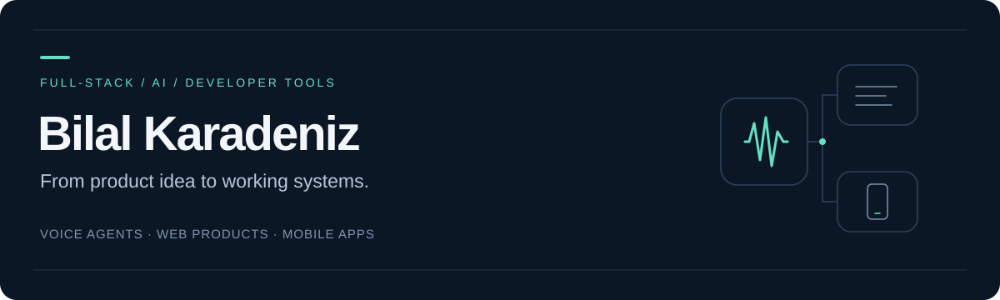

  

  <a href="https://www.linkedin.com/in/bilal-karadeniz-8539b1169/"><b>LinkedIn</b></a> &nbsp; / &nbsp;
  <a href="https://www.upwork.com/freelancers/~01863ee50622bba2e2"><b>Upwork</b></a> &nbsp; / &nbsp;
  <a href="https://www.veloquence.ai/"><b>Veloquence</b></a>

### Building the product and the systems behind it

I'm Bilal, a software developer based in Ankara, Türkiye. I build **AI voice agents, full-stack web products, mobile apps and developer tools** — connecting interfaces, APIs, data and deployment into complete user workflows.

My largest project is **Veloquence**, an AI voice and text platform for business websites. I work across its frontend, backend, knowledge retrieval and real-time voice systems. The project began under Curately and continued under Veloquence.

### Selected work

<table>
<tr>
<td width="50%" valign="top">
<h3>01 / Conversational AI</h3>
<b><a href="https://www.veloquence.ai/">Veloquence</a></b> 
Voice and text agents, knowledge retrieval and visitor qualification.  
Next.js · FastAPI · PostgreSQL · Qdrant · Pipecat
</td>
<td width="50%" valign="top">
<h3>02 / Developer tools</h3>
<b><a href="https://github.com/bilal07karadeniz/Grafyx">Grafyx</a></b> 
MCP tools for exploring code relationships, callers, dependencies and project structure.  
Python · MCP · Source analysis · Semantic search
</td>
</tr>
<tr>
<td width="50%" valign="top">
<h3>03 / SaaS products</h3>
<b>Foodlex</b> 
An AI-assisted platform for dietitians: client records, diet plans, appointments and reporting.  
Next.js · FastAPI · PostgreSQL · LLM APIs
</td>
<td width="50%" valign="top">
<h3>04 / Mobile applications</h3>
<b>TusTrack</b> 
Study planning, timers, revision cards and progress tracking, with iOS release work.  
React Native · Expo · TypeScript · Supabase
</td>
</tr>
</table>

### Tools I work with

**Web & mobile** &nbsp; — TypeScript · React · Next.js · React Native · Expo  
**Backend & data** &nbsp; — Python · FastAPI · PostgreSQL · Redis · Celery  
**AI & voice** &nbsp; — RAG · Qdrant · Pipecat · Speech APIs · MCP  
**Delivery** &nbsp; — Docker · GitHub Actions · Railway · Netlify · pytest · Jest

### How I work

Clear interfaces, maintainable systems and verification suited to the change. I use AI-assisted development alongside source inspection, automated checks and visual testing.

---

<b>Have a product to build or a system to improve?</b> Let's connect on <a href="https://www.linkedin.com/in/bilal-karadeniz-8539b1169/">LinkedIn</a> or <a href="https://www.upwork.com/freelancers/~01863ee50622bba2e2">Upwork</a>.

